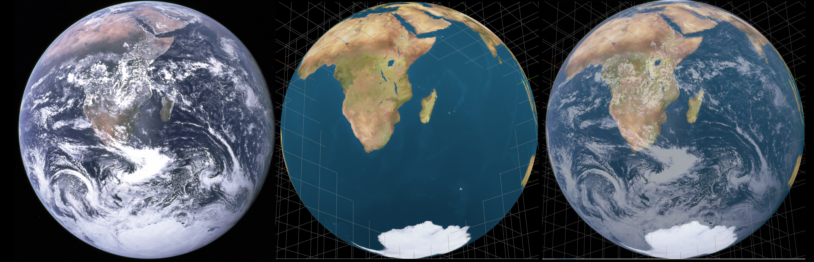
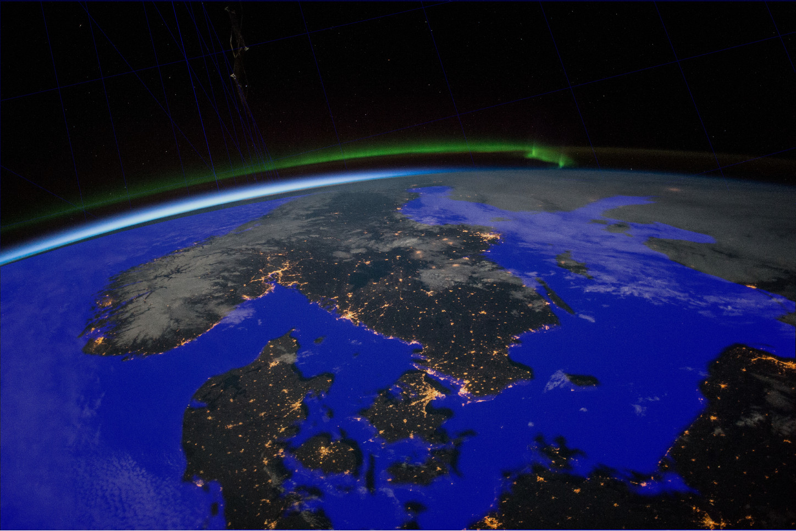
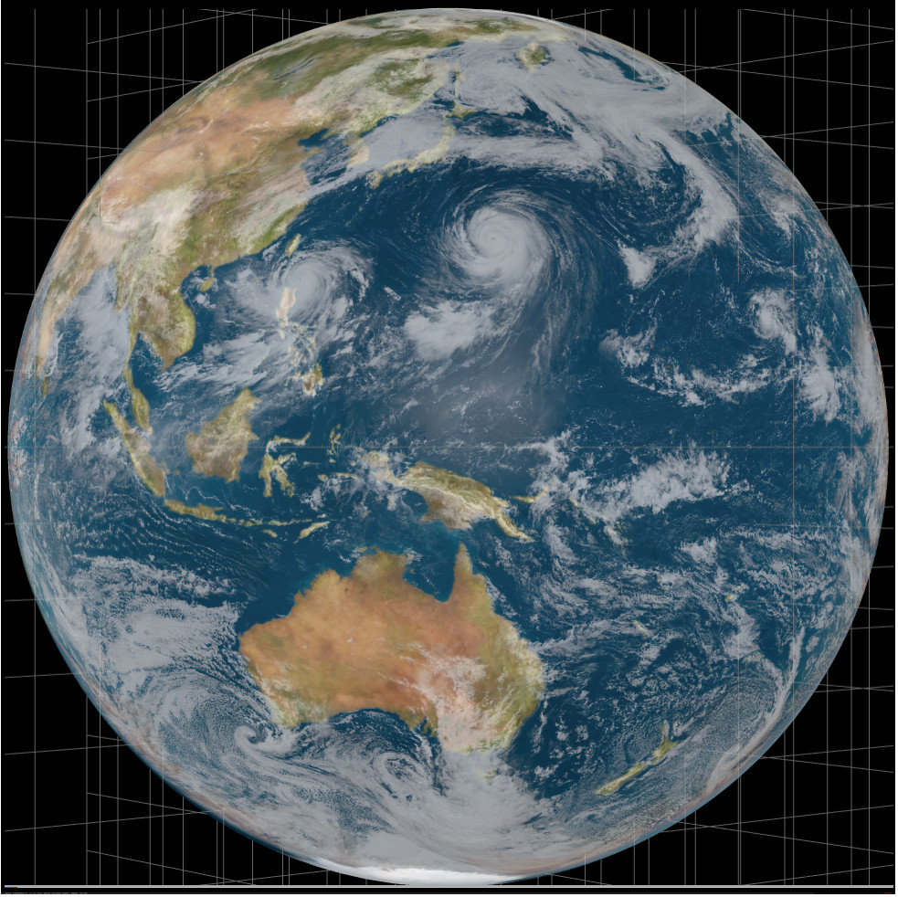

# satfov
A quick visualization depicting how the distance of an Earth imaging satellite influences the size of continents in the image when the size of the globe is kept constant by varying the field of view. 

Click below to execute in browser.

The app also contains presets, which attempt to reproduce continent sizes seen in the 1972 Blue Marble, ISS photo of Scandinavia and images from the Himawari-8. The generated images are compared below with overlays.

